#**Manual Técnico**
El código del programa se divide en varias partes importantes, ya que su función principal es el análisis de textos con operaciones matemáticas básicas, así que se empezará explicando la parte de como se realizo el analisis del texto.

Lo primero que tenemos son 3 clases abstractas llamadas "Abstract", "Lexema", "Numero", con estas clases abstractas tenemos clases que sirve comon la base para el resto de las clases, esta solo definira los atributos y métodos que utlizaremos para todo el analisís.
Esta es la clase "Abstract"

  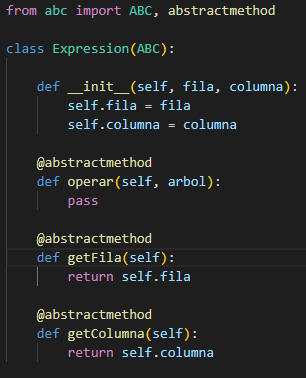

Esta es la clase "Lexema"

  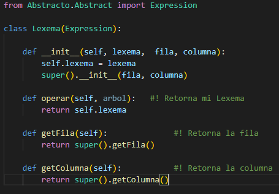

Esta es la clase "Lexema"

  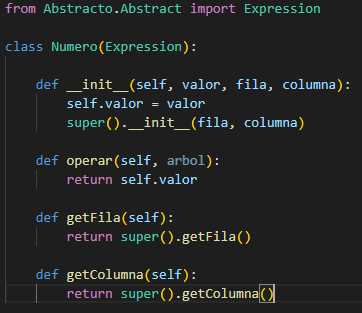

Luego tenemos 3 clases que nos ayudarán a leer los datos de los archivos a analizar, estas son "Aritmetica", "Texto" y "Trigonometria", a continuación veremos como funciona la clase "Aritmetica".

  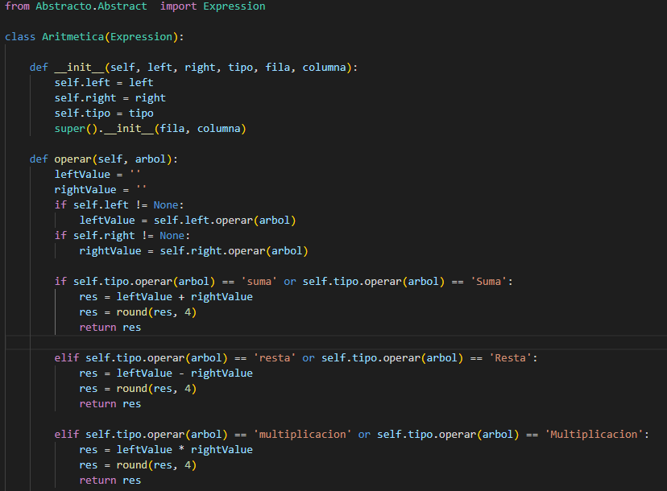

  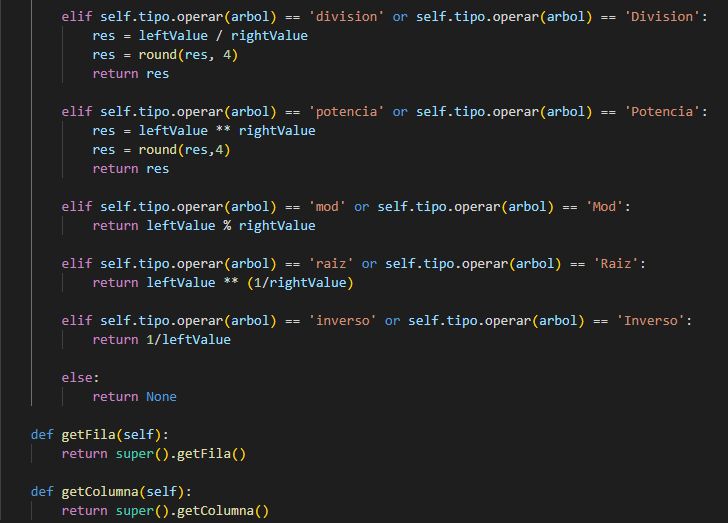

Lo primero que hace es definir un método para inicializar valores, en el cual tambien heredamos de la clase "Abstract" los datos de fila y columna. Luego damos paso a otro método llamado "Operar" el cual nos permitira hacer las opreaciones aritméticas, como suma, resta, multiplicación, división, potencia, raiz, modulo e inversos, operando los 2 valores que se nos darán en el archivo a leer, y se guardan los valores como "leftValue" y "rightValue" y el resultado se guarda en la variable "res" para luego redondear esta a 4 decimales y por último retornarlo.
Luego en los siguientes métodos de "getFila" y "getColumna" obtenemos las columnas y filas del archivo usando herencia de nuestra clase "Abstract".

Ahora pasamos a ver el código de la clase "Texto".

  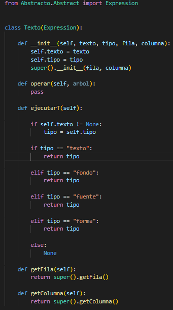

Al igual que hacemos con la clase "Aritmetica", aquí tambien inicializamos valores, con la diferencia que no usaremos los valores "leftValue" y "rightValue", ya que aquí solo analizaremos textos, los cuales nos servirán para crear nuestras gráficas, analicis el cual se hace en el método "ejecutar" solo corroboramos que los textos leidos cumplan con la sintaxis correca par aluego obtener la fila y la columna por medio de la herencia de la clase "Abstract".

Ahora pasamos a la clase "Trigonometria".

  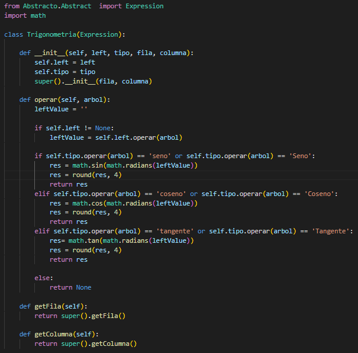

Esta clase es parecida a la de "Aritmetica", solo que esta en vez de recibir 2 este solo recibe 1 valor, y valida que vengan funciones trigonometricas se Seno, Coseno y Tangente, redondeando los resultados a 4 decimales, para luego obtener las filas y columnas de donde se encontró la función trigonométrica.

Ahora, con las funciones básicas de nuestro analizador, pasamos a ver el código que se encarga de juntar todo esto para leer los datos de nuestro archivo.

  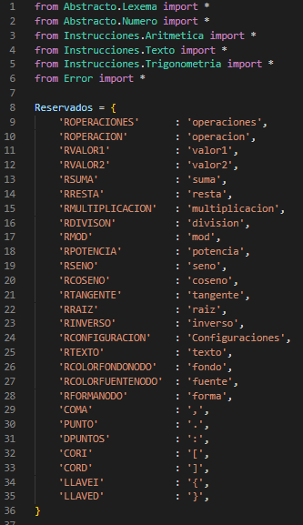

Lo primero que hacemos es importar todas las clases que vamos a utilizar para el análisis, luego, se crea un diccionario que almacenará las palabras reservadas para cada operación que realizará nuestro analizador.

  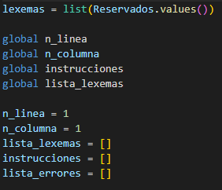

En esta parte del código lo que se hace es crear un varaible llamada "lexemas" que servira para almacenar las palabras reservadas que usaremos en una lista, luego se crean 4 varaibles globales que serviran para, las líneas y columnas de lectura, las instrucciones que realizará el programa y la lista de los lexemas encontrados, luego inicializamos estos valores y creamos una lista para los errores.

  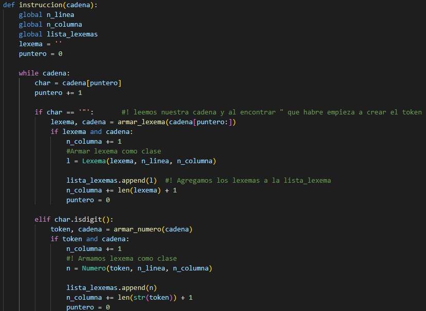

En esta parte del código entramos a un metodo llamado "instruccion", el cual recibe por parametro una cadena, la cual será analizada a continuacion; Los primero que hacemos es crear una variable lexema que llevará como dato '', y un puntero, que empieza en 1, luego entramos en un ciclo while el cual se ejecutará mientras estemos dentro de una cadena, luego se crea una variable "char" que llevará la lista cadena en la cual estará el puntero.

Luego empezamos con las validaciones para nuestra cadena, si en la variable "char" se almacena un una comilla doble ("), se empieza a aarmar el lexema, ahora, si detecta que es un dígito, se empieza a crear el número.

  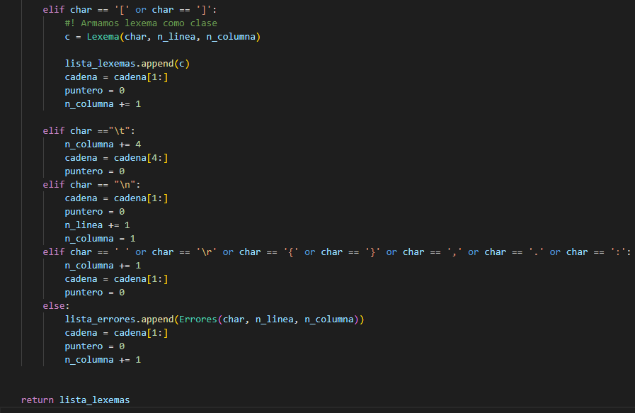

Continuamos con las validaciones para los corchetes, tabulaciones, saltos de línea, llaves, comas, puntos y dos puntos.

  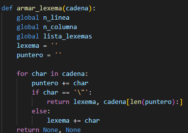

Luego tenemos un nuevo método que nos servira para ir armando nuestros lexemas, donde tendremos las variables globales de n_linea, n_columna, lista_lexemas, lexema, y puntero, para luego recorrer la cadena formamos usando el método anterior, y para determinar el final de esta, lo sabremos cuando venga una comilla doble al final, de esta forma concluiremos con el lexema, y lo guardaremos.

  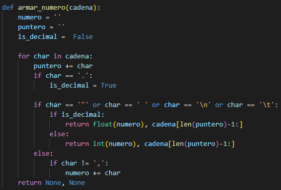

Ahora entramos al método que nos permitirá armar los números, para ello lo primero que se hace es detectar si el número trae un punto, si es así sabemos que es un número decimal, de lo contario, si trae una coma, quiere decir que el número ha terminado.

  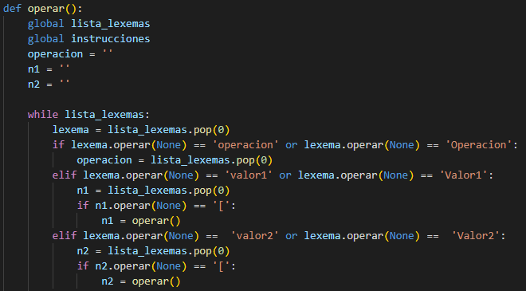

  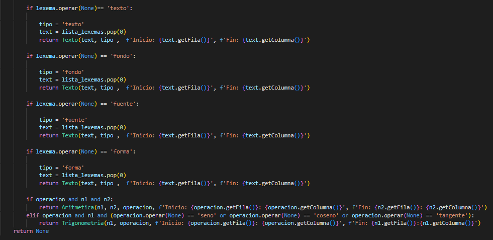

Ahora entramos a un nuevo método llamado "operar", el cual, se encargará de hacer las operaciones correspodientes con los valores que vengan, pero primero, tenemos que leer los lexemas, para ello usamos diferentes condicionales, si nuestro lexema lee "operacion" u "Operacion", almacenaremos la operacion en la lista de lexemas, si lee "valor1", "Valor1", "valor2" o "Valor2", sabrá que son numeros u operaciones anidadas, dependiendo si lee el número o un corchete de abertura.

Luego seguimos haciendo validaciones, pero esta vez para las configuraciones que puedan venir para crear la gráfica y por último, 