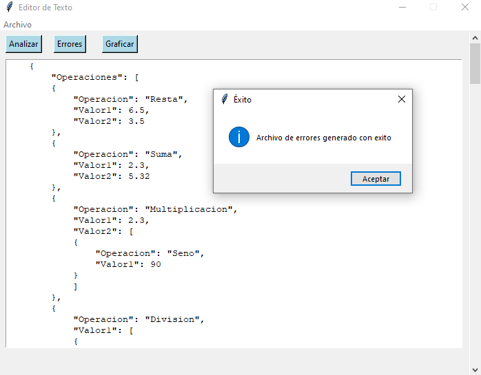

#**Manual de Usuario**
###Requisitos para el uso del programa
1. Tener un IDE que lea python instalado para visualizar el proyecto.
2. Un previsualizador para archivos con formato Markdown

##Uso del programa
Al ejecutar el programa se nos desplegará la siguiente ventana:

  

En esta ventana contaremos con un widget de texto en la parte inferior, y en la superior tendremos multiples opciones en una barra de menú que nos permitira hacer clic en cada una de ellas, si damos clic en la opción archivo, se nos mostrarán diferentes opciones como Abrir, Guardar, Guardar Como y Salir.

  

Al dar clic sobre la opción "Abir" se nos desplegará una ventana para seleccionar los archivos que querramos usar (deben tener la extensión .json).

  

Una vez elegido algún archivo, se nos mostrará su contenido en el widget de texto.

  

Desde este, podremos editar el texto si queremos y podremos guardar el texto para no perder los cambios realizados, ahora, si lo que queremos es analizar el texto que tenemos, bastará con dar clid en el botón de "Analizar" que esta en la parte superior.

  

Como se puede ver en la imagen superior, al momento de dar clic en "Analizar", el programa se encargará de leer todo el texto, en busca de la resolución de cada una de las operaciones que se le indican, y al terminar, nos mostrará una ventana emergente con los resultados de dichas operaciones.

Si queremos saber los errores léxicos que pueda llegar a encontrar al momento de analizar el texto, daremos clic en el botón de "Errores".

  

Esto generará un archivo .txt en la carpeta del programa donde podremos observar los errroes léxicos que tuvo el programa, si en dado caso no los hay, nos dará un archivo vacio.

Ahora, si queremos ver los resultados en forma gráfica, deberemos pulsar el botón "Graficar"